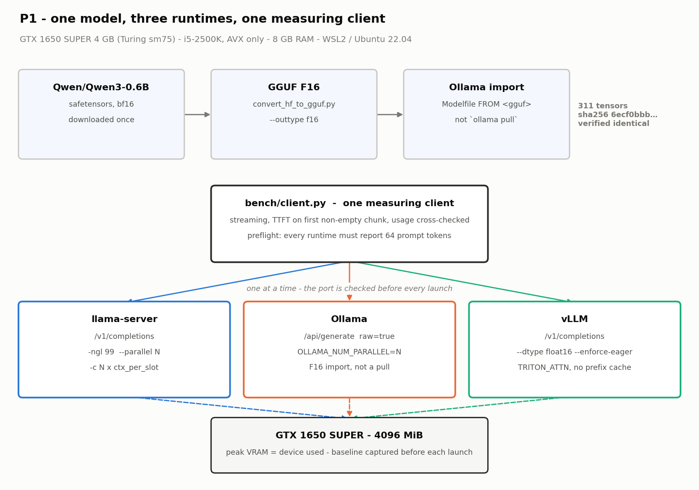
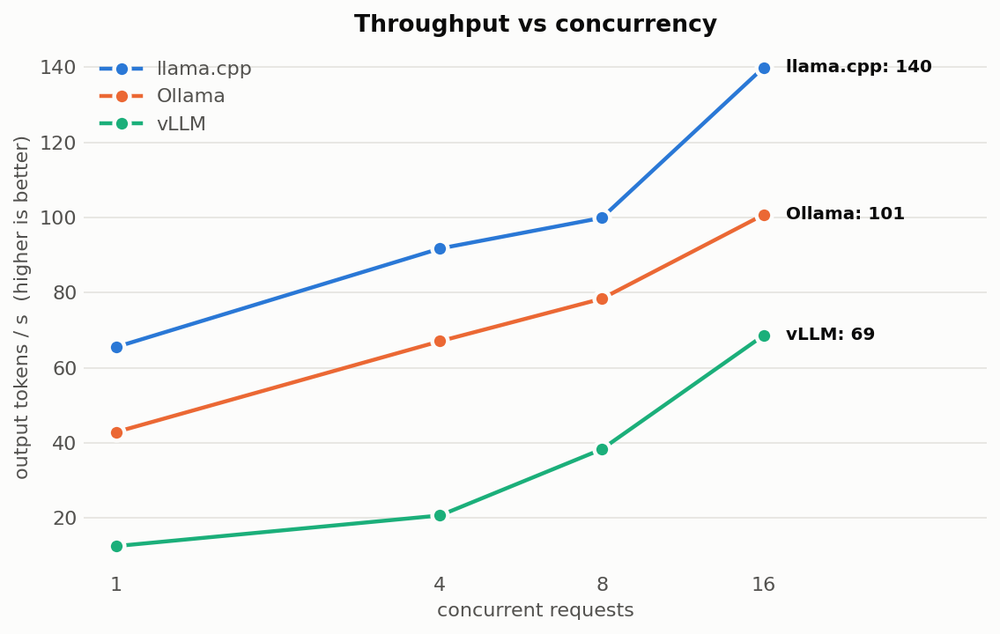
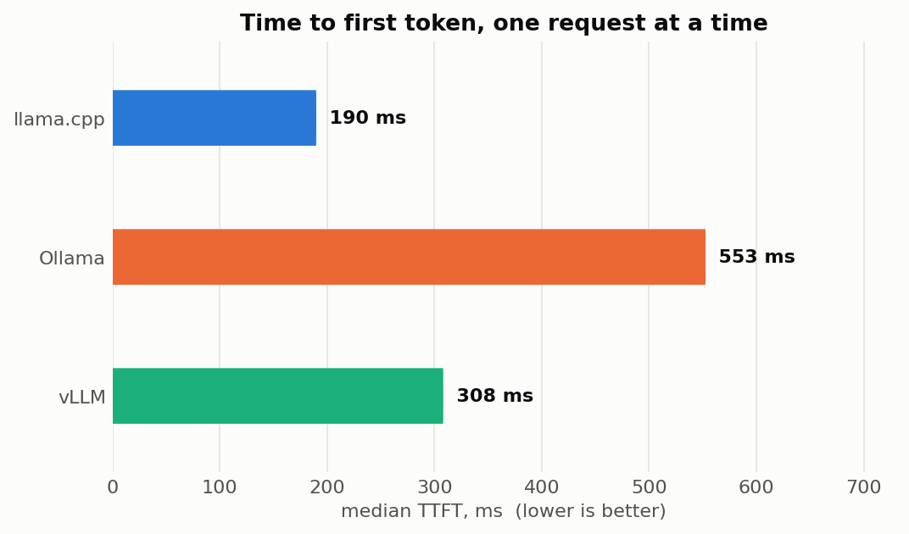
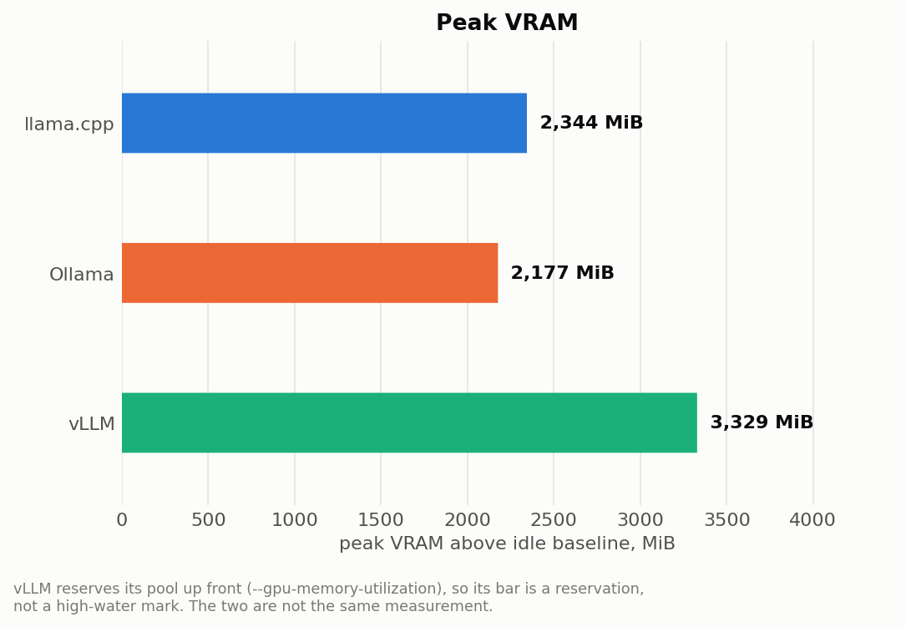
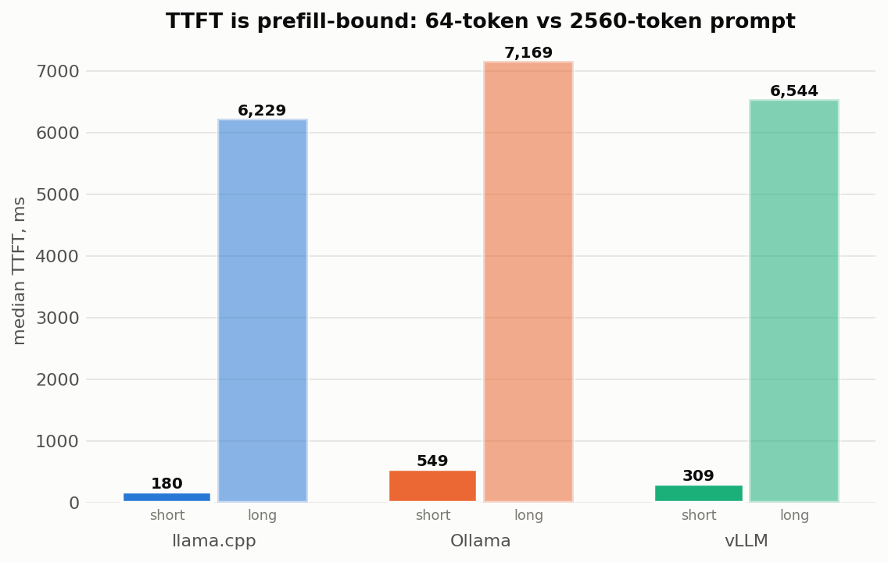

# P1 — Local inference benchmark: Ollama vs llama.cpp vs vLLM

One model, one set of weights, one measuring client, three runtimes — on a
4 GB GPU that is old enough to make every constraint explicit.

**Headline:** on this hardware **llama.cpp wins at every concurrency tested**,
delivering **2.0× vLLM's throughput** and **1.4× Ollama's** at 16 concurrent
requests. vLLM scales far better (**×5.5** from 1 to 16 concurrent requests
against llama.cpp's ×2.1) but starts so far behind that it never catches up
within the range this card can hold. The received wisdom — "vLLM wins on
throughput" — is a statement about hardware this project did not have.



---

## 1. The task

Choosing an inference runtime for an on-prem deployment is usually done by
reputation. Reputation is formed on A100s and 7B models; it does not transfer to
a 4 GB Turing card, and the difference is worth a measurement rather than a
guess. This project runs one model on Ollama, llama.cpp and vLLM under
conditions that are identical by construction, and reports TTFT, TPOT,
throughput, peak VRAM and cold start for each.

The harness (`bench/`) is written to be lifted into later projects unchanged.

## 2. Experimental conditions

| | |
|---|---|
| GPU | GTX 1650 SUPER, 4096 MiB, **compute capability 7.5** (Turing), driver 591.86 |
| CPU | Intel i5-2500K, 4 cores, **AVX only — no AVX2 / FMA / F16C / BMI2** |
| RAM | 8 GB assigned to WSL2 (host has 11.5 GiB) |
| OS | WSL2, Ubuntu 22.04, Python 3.10.12 |
| Model | **Qwen3-0.6B**, dense, 28 layers, GQA 16Q/8KV, head_dim 128 |
| Precision | **FP16 everywhere, unquantized** |
| llama.cpp | commit `af51726`, built from source, CUDA 12.3, `sm75` |
| Ollama | `v0.32.14`, local install, no systemd |
| vLLM | `0.27.1`, torch 2.13.0, TRITON_ATTN backend |
| Sampling | `temperature=0`, `top_p=1`, `max_tokens=128`, no `ignore_eos` |
| Context | 512 tokens/slot (sweep), 4096 tokens/slot (long prompt) |
| Method | 3 runs per point, median reported, warm-up discarded, **fresh server per run** |

### Why FP16 and why 0.6B

Both fall out of the GPU rather than from preference. vLLM's quantized kernels
require compute capability ≥ 8.0 and refuse to load on sm75, so vLLM can only
serve unquantized weights here — which caps the model at roughly 1.5B in 4 GB
once a usable KV cache is subtracted.

That constraint turned out to be a gift. Since vLLM must run FP16, llama.cpp and
Ollama can be given a GGUF converted from **the same safetensors at F16**, and
quantization stops being a variable of the experiment instead of being a caveat
at the bottom of the page.

### The weights really are the same

`ollama create` rewrites the GGUF it imports, so a file-level checksum reports
"different" and tells you nothing. `scripts/verify_weights.py` hashes the tensor
payload instead:

```
llama.cpp GGUF : 311 tensors, payload sha256 6ecf0bbb7d84d78b…
Ollama blob    : 311 tensors, payload sha256 6ecf0bbb7d84d78b…
metadata fields differing: none
```

vLLM loads the safetensors those were converted from, at the same precision.

### The prompt really is the same

Every runtime is handed one fully-rendered string — the chat template is applied
once, by `prompts/build_prompts.py`, never by the runtime. Before measuring,
`bench/run.py` sends one request and **aborts the run unless the runtime reports
the same prompt length we sent**. All three report 64 tokens.

That check is not decorative: Ollama's OpenAI-compatible endpoint fails it. See
Limitations.

---

## 3. Results

`results/summary.csv` holds every number; `results/raw/*.jsonl` holds every
request.

### Throughput vs concurrency



| concurrent requests | 1 | 4 | 8 | 16 | scaling 1→16 |
|---|---|---|---|---|---|
| **llama.cpp** | **65.5** | **91.7** | **99.9** | **139.9** | ×2.14 |
| **Ollama** | 42.9 | 67.1 | 78.4 | 100.8 | ×2.35 |
| **vLLM** | 12.5 | 20.7 | 38.3 | 68.6 | **×5.48** |

*output tokens/s, median of 3 runs, 64-token prompts*

The shape matters more than the ranking. vLLM's continuous batching is doing
exactly what it is advertised to do — it is the only runtime whose throughput
grows faster than 2.5× across the range — but it begins at a fifth of
llama.cpp's single-stream rate, and 16 concurrent requests is not enough runway.
Extrapolating the two curves, the crossover sits somewhere past concurrency 30;
vLLM's KV cache here holds 17,792 tokens, i.e. about 34 concurrent 512-token
requests, so that crossover is *just* inside what this card could physically
hold and outside what was measured.

### TTFT, single stream



| | llama.cpp | vLLM | Ollama |
|---|---|---|---|
| TTFT p50 | **190 ms** | 308 ms | 553 ms |
| TTFT p95 | 219 ms | 333 ms | 574 ms |
| TPOT p50 | **12.2 ms** | 76.3 ms | 14.8 ms |

vLLM's TPOT — 76 ms/token against llama.cpp's 12 — is the cost of
`--enforce-eager`. CUDA graph capture is what removes vLLM's per-step Python
overhead, and it needs several hundred MiB of VRAM this card cannot spare. On a
0.6B model that overhead is most of the step.

Ollama and llama.cpp share an engine, and their TPOT agrees to within 20%. The
gap between them is almost entirely per-request overhead, which is where a
convenience layer would be expected to put it.

### Peak VRAM



| | llama.cpp | Ollama | vLLM |
|---|---|---|---|
| peak VRAM over idle | 2335 MiB | **2177 MiB** | 3327 MiB |
| peak host RSS | 2074 MiB | **1669 MiB** | 3227 MiB |

**These are not the same measurement.** vLLM reserves its pool up front from
`--gpu-memory-utilization 0.80`, so its figure is a *reservation*; the other two
are high-water marks. vLLM would run in less, and llama.cpp would use more if
asked for more slots.

WSL2 does not report per-process GPU memory — `nvidia-smi
--query-compute-apps` returns an empty table — so peak VRAM is device-wide
`used` minus a baseline captured immediately before each launch. The baseline is
the Windows desktop's share and it drifts: it was observed moving between 385
and 860 MiB within one session, which is why it is never reused across servers.

### Long prompt vs short: prefill dominates



| TTFT p50, concurrency 1 | 64-token prompt | 2560-token prompt | ratio |
|---|---|---|---|
| llama.cpp | 185 ms | **6165 ms** | 33.4× |
| Ollama | 538 ms | 7045 ms | 13.1× |
| vLLM | 309 ms | 6539 ms | 21.2× |

A 40× longer prompt costs 13–33× more time to first token, and all three
runtimes land within 15% of each other — because at this length they are all
doing the same thing, and it is the GPU doing it. llama.cpp's own log puts
prefill at ~430 tokens/s: six seconds of prompt processing against under one
second of generation.

**For long-context work on this class of card, prefill is the product.** Token
generation speed, the number everyone quotes, is noise by comparison.

### Cold start

| | llama.cpp | Ollama | vLLM |
|---|---|---|---|
| process start → first completed generation | **2.1 s** | 7.3 s | 61.1 s |

Measured to a *completed generation*, not to a healthy port: llama-server binds
its port about three seconds before it can answer, so timing to readiness would
have flattered it by more than its whole cold start.

---

## 4. When to use which

**llama.cpp** — the default here, and it is not close. Fastest at every
concurrency, lowest TTFT, lowest TPOT, 2.1 s cold start. The cost is
operational: you build it yourself (mandatory on this CPU — see below), you
manage the process, and there is no model management to speak of.

**Ollama** — 72% of llama.cpp's throughput at concurrency 16 and 2.9× its TTFT,
in exchange for model management, an import/registry workflow, and a server that
stays up. It is the same engine underneath; you are paying for the wrapper in
per-request latency, not in token generation speed. A reasonable trade for
interactive and internal tools, a poor one under load.

**vLLM** — not on this hardware. It loses at every concurrency tested, needs a
minute to start, cannot use quantized weights on sm75, and needs `--enforce-eager`
on 4 GB, which is precisely what makes its per-token cost 6× llama.cpp's. But
its scaling curve is the steepest of the three by a factor of 2.5, and that is
the property it is actually built for: on a card that can hold hundreds of
concurrent sequences and run CUDA graphs, the ranking in this table should
invert. **The lesson is not "vLLM is slow" — it is that vLLM's advantage is
purchased with VRAM, and this card has none to spare.**

**If your prompts are long**, the choice matters much less than it appears: all
three converge to within 15% because prefill dominates, and you should be
shopping for a faster GPU rather than a different runtime.

---

## 5. Limitations

Stated plainly, because several of them are the whole point.

1. **The model is 0.6B, not 7–8B.** Forced by 4 GB of VRAM and vLLM's inability
   to use quantized weights on sm75. Absolute numbers do not transfer to larger
   models; the shapes of the curves are more likely to.
2. **vLLM ran with `--enforce-eager`.** CUDA graphs need VRAM this card cannot
   spare. This is a genuine handicap and a large part of why vLLM's TPOT is 6×
   llama.cpp's. It is a real constraint of the hardware, not a misconfiguration,
   but a 4 GB result should not be read as a verdict on vLLM.
3. **Peak VRAM is not comparable across runtimes** — reservation vs high-water
   mark, as described above.
4. **Ollama is measured through `/api/generate`, not `/v1/completions`.** Its
   OpenAI-compatible layer re-applies the chat template to a prompt that already
   carries one: the same string arrives as 72 tokens instead of 64, and the
   re-templating switches Qwen3's thinking mode back on, so the model spends its
   budget emitting a `<think>` block and hits `max_tokens`. Measured that way
   Ollama was doing different work on a different prompt. `raw: true` on the
   native endpoint passes the string through untouched. **This is a deviation
   from "one endpoint everywhere", chosen because prompt identity matters more
   than API uniformity.**
5. **`ignore_eos` is off.** It would have made every runtime emit exactly
   `max_tokens`, which is tidier — but on Qwen3 it makes llama-server's output
   parser reject ~6% of streams mid-generation, and Ollama never forwarded it
   anyway, so it could not have been symmetric. Output lengths are instead
   reported per point (`output_tokens_p50`) and agree across runtimes to within
   one token, which is the evidence that the runtimes are doing equal work.
6. **Ollama and llama.cpp are not independent** — Ollama wraps llama.cpp. Two of
   the three "runtimes" share an engine, and their TPOT agreement reflects that.
7. **Three runs per point.** Enough for the 1–3% run-to-run spread observed
   after fixing the leak-driven degradation, not enough for tight confidence
   intervals.
8. **Single machine, single session.** No thermal steady-state control beyond
   discarding warm-up.

---

## 6. What this cost to get right

Nine defects were found in the harness or its configuration during this project.
**None of them produced an error. Every one produced plausible numbers.** They
are documented because the failure mode is the interesting part:

| What was wrong | What it would have reported |
|---|---|
| `http_proxy` set for `127.0.0.1`, honoured by httpx | proxy round-trip time, as runtime latency |
| Truncated SSE streams counted as successes | 31 of 406 requests with a flattering TTFT |
| `ignore_eos` tripping llama-server's output parser | ~6% of generations silently cut short |
| Prompt list restarting at index 0 each run | TTFT 188 ms → 24 ms as the prompt cache warmed |
| Shared instruction prefix across prompts | prefill measured on 49 of 64 tokens |
| llama-server leaking ~295 MiB/request | "llama.cpp degrades under load" — it was swapping |
| `env:` block built but never passed to `Popen` | Ollama measured at default parallelism |
| Ollama's OpenAI layer re-templating the prompt | 72 tokens vs 64, and a different task |
| `OLLAMA_FLASH_ATTENTION=0`, set for tidiness | Ollama 5.4× slower on TTFT |

The last one is the most instructive. It was set deliberately — sm75 has no
FlashAttention-2, so stating it explicitly seemed more rigorous than leaving it
to a default. Ollama logs `FLASH_ATTENTION:false` either way, so the setting
responsible for a 5.4× difference does not appear in the configuration the
runtime reports. Being explicit was the bug.

The guards that now exist because of these: a preflight prompt-length check per
server, a tensor-payload weight comparison, streams that must reach a proper
terminator to count, a fresh server per run, and 47 unit tests over the metric
and config plumbing.

---

## 7. Reproducing

```bash
python3 -m venv .venv && .venv/bin/python -m pip install -U pip
.venv/bin/python -m pip install -r requirements.txt

bash scripts/build_llamacpp.sh    # source build; stock binaries SIGILL on this CPU
bash scripts/install_ollama.sh    # local, no root, no systemd
bash scripts/install_vllm.sh      # own venv; removes flashinfer, see below
bash scripts/prepare_model.sh     # safetensors -> GGUF F16 -> Ollama import
.venv/bin/python prompts/build_prompts.py --count 400 --long-count 64

.venv-convert/bin/python scripts/verify_weights.py   # must print IDENTICAL
.venv/bin/python -m pytest                           # 48 tests
.venv/bin/python -m bench.run --dry-run
```

`prepare_model.sh` creates `.venv-convert` on the way through: the GGUF
converter needs torch, and the measurement venv is kept light on purpose so it
stays liftable into P2/P5. It also starts and stops its own Ollama server for
the import, on the same model store `bench/run.py` will later read — an import
into the default `~/.ollama` would leave the benchmark reporting "model not
found" for a model that had just been built.

A CUDA 12.x toolkit must be present for the llama.cpp build. Ubuntu's packaged
`nvidia-cuda-toolkit` is 11.5 and will not do; `build_llamacpp.sh` says so
explicitly if it finds nothing at `CUDA_HOME`.

Then, one runtime at a time — `bench/run.py` refuses to start if the port is
already listening:

```bash
.venv/bin/python -m bench.run --runtime llamacpp
.venv/bin/python -m bench.run --runtime ollama
.venv/bin/python -m bench.run --runtime vllm
.venv/bin/python -m analysis.plots
```

### Hardware-specific traps, all handled by the scripts

* **Stock llama.cpp binaries crash on this CPU.** Sandy Bridge has AVX but no
  AVX2/FMA/F16C/**BMI2**; `GGML_BMI2` defaults to ON and BMI2 is two generations
  newer than this chip. A correct configure prints
  `-msse4.2;-mavx`, nothing more.
* **Ubuntu's nvcc 11.5 cannot compile llama.cpp** against GCC 11
  (`parameter packs not expanded`). The build uses the CUDA 12.3 toolkit under
  `/usr/local/cuda` explicitly rather than whatever `nvcc` is on `PATH`.
* **vLLM will not start on WSL2 without `VLLM_WSL2_ENABLE_PIN_MEMORY=1`.** It
  disables pinned memory under WSL by default, then requires UVA, which requires
  pinned memory: `RuntimeError: UVA is not available`.
* **flashinfer does not import on Python 3.10** (it annotates with
  `array.array[int]`, subscriptable only from 3.11), and vLLM's sampler probes
  for it by importing it. Uninstall it and set
  `VLLM_USE_FLASHINFER_SAMPLER=0`.
* **`--disable-log-requests` was removed in vLLM 0.27** and makes it exit
  instantly.

Note that none of the vLLM blockers were the Turing GPU. Compute capability 7.5
never came up.

---

## 8. What next

* **Concurrency 32.** vLLM's KV budget here holds ~34 concurrent 512-token
  sequences, so the crossover point the curves imply is measurable on this card
  rather than extrapolated. This is the single highest-value addition.
* **`--enforce-eager` vs CUDA graphs**, on a card with the VRAM for both, to
  separate "vLLM on 4 GB" from "vLLM".
* **Quantization** — the same harness against Q4_K_M/Q6_K/IQ2_XXS on
  llama.cpp, including the point where the model stops fitting in VRAM and
  layers spill to a PCIe 2.0 bus.
* **Repeat on a rented GPU** with an 8B model, to test whether the ranking here
  inverts as the hardware argument predicts. The harness moves unchanged; only
  `configs/experiment.yaml` differs.

## Layout

```
configs/experiment.yaml   single source of truth; nothing hardcoded in bench/
prompts/build_prompts.py  exact-length prompts, distinct per request
bench/client.py           the one measuring client, shared by all runtimes
bench/metrics.py          pure TTFT/TPOT/percentile functions — unit tested
bench/monitor.py          NVML sampler for VRAM/RSS
bench/run.py              orchestrator for the runtime x concurrency matrix
scripts/verify_weights.py proves the three runtimes share tensor data
runtimes/*.md             how each runtime is launched, and what bites
results/summary.csv       every measurement point
results/raw/*.jsonl       every request
```
